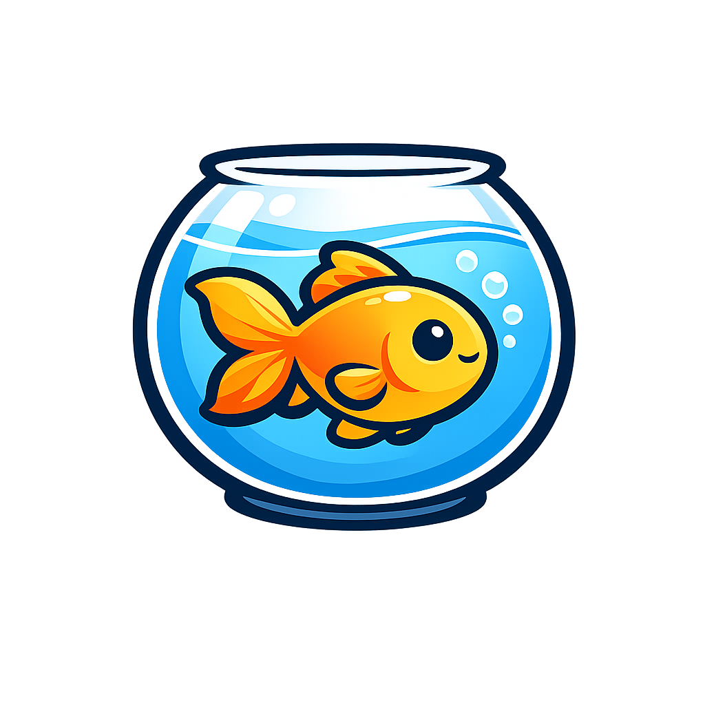

<p align="center">
  
</p>

<h1 align="center">🐠 GoldFish</h1>

<p align="center">
  <em>내 투자·거래 데이터를 어항 들여다보듯 분석해주는 도구 — <strong>Watch your money swim.</strong></em>
</p>

<p align="center">
  <a href="https://github.com/jinjerry0927/goldfish/actions/workflows/ci.yml"></a>
  <a href="https://pypi.org/project/goldfish-finance/"></a>
  
  <a href="LICENSE"></a>
</p>

CSV 또는 토스증권 조회 API로 투자·거래 데이터를 넣으면 **통계 프로파일링 + 금융 특화 진단 + AI 자연어 코칭**을 담은 리포트(텍스트·차트·HTML)를 만들어 주는 Python 라이브러리/CLI입니다.

기존 범용 프로파일링 도구와 달리 **금융 데이터에 특화**되어 있고, 분석 결과를 AI가 사람 말로 해설·경고해 주는 것이 차별점입니다.

---

## ✨ 기능

**v0.1 — 기본 프로파일링**

- 📥 **CSV 로더** — 한글/BOM/`cp949` 자동 처리
- 📊 **기본 프로파일링** — 행·열 수, 결측치, 데이터 타입, 분포(평균/중앙/표준편차/분위)
- 🔎 **이상치 탐지** — IQR(1.5배) 기준
- 🔗 **상관관계** — 수치형 컬럼 간 상관계수 상위 페어
- 🖥 **CLI** — `goldfish <csv경로>` 한 줄로 텍스트 리포트

**v0.2 — 금융 특화 진단 + 차트**

- 🧮 **스키마 검증** — 거래내역 필수 컬럼 자동 인식(필요 시 안내), 식별자(종목코드) 분리
- 🥧 **포트폴리오 집중도** — 종목별 비중, 상위 N 편중도, HHI 집중지수
- 🔁 **매매 패턴** — 매수/매도 빈도, 거래일당 체결 수(과매매 지표), 요일·시각대 분포
- 🎯 **손절·익절 습관** — 승률, 손익비(Profit Factor), 평균/최대 익절·손절
- 📈 **수익률·변동성** — 실현손익 기반 수익률·변동성 추정
- 📊 **차트** — 종목 비중 막대, 거래 분포, 실현손익 히스토그램 PNG 저장

**v0.3 — AI 자연어 코칭**

- 🤖 **AI 요약** — 분석 수치를 Gemini(무료 티어)가 사람 말로 해설·경고
- 🛡 **가드레일** — "진단·설명만, 투자 추천 금지" 시스템 프롬프트로 강제
- 🔌 **기본 끔 + fallback** — 키(`GEMINI_API_KEY`)가 없으면 통계만 출력(크래시 없음)

**v0.4 — 토스 조회 연동 + HTML 리포트**

- 🏦 **토스증권 Open API 로더** — OAuth2 인증으로 체결내역을 표준 스키마 DataFrame 으로 (조회 전용)
- 🔒 **read-only 엄수** — 인증 외 전부 GET, 주문 생성/정정/취소는 **구현하지 않음**(테스트로 강제)
- 📄 **HTML 리포트** — 기본분석 + 금융진단 + 차트 + AI 요약을 **자기완결 HTML 한 장**으로(차트 인라인 임베드)

**v1.1 — 워크스페이스 + 입력 자동 정리**

- 📂 **`goldfish init`** — 양식·실행기·리포트 폴더를 갖춘 **분석 워크스페이스**를 한 줄로 생성
- 🗂 **폴더 일괄 분석** — `goldfish <폴더>` 로 폴더 안 CSV/엑셀을 한 번에 리포트로
- 🧹 **입력 자동 정리** — 천단위 쉼표(`1,234`) 자동 제거, 엑셀(xlsx) 직접 인식, 빈 행 제거, 종목코드 앞자리 0 보존

> 로드맵: ~~v0.2 금융 특화 진단·차트~~ ✅ · ~~v0.3 AI 코칭~~ ✅ · ~~v0.4 토스 연동·HTML 리포트~~ ✅ · ~~v1.0 PyPI 배포~~ ✅ · ~~v1.1 워크스페이스~~ ✅

---

## 📦 설치

```bash
# PyPI (v1.0부터): 배포명은 goldfish-finance, import 는 그대로 `goldfish`
pip install goldfish-finance

# 또는 소스에서 (개발용)
git clone https://github.com/jinjerry0927/goldfish.git
cd goldfish
pip install -e .
```

> Python 3.10+ 필요. PyPI에 `goldfish` 이름은 무관한 패키지가 선점하여
> **배포명은 `goldfish-finance`**, 코드 import 는 `import goldfish` 그대로입니다.

---

## 🚀 사용 예시

```bash
# 샘플 합성 데이터 생성
python examples/generate_sample.py

# 분석 리포트 출력
goldfish examples/sample.csv
```

### 📂 워크스페이스 (v1.1) — 폴더에 넣고 더블클릭

증권사에서 받은 거래내역을 **폴더에 넣기만 하면** 리포트가 나오는 작업 공간을 만들 수 있습니다.

```bash
goldfish init               # 'goldfish-분석' 폴더 생성 (양식·실행기·리포트 폴더 포함)
goldfish init 내폴더명       # 폴더 이름 지정도 가능
```

생성된 폴더에 거래내역 CSV/엑셀 파일을 넣고:

```bash
goldfish goldfish-분석       # 폴더 안 모든 파일 → 리포트/ 에 HTML 일괄 생성
```

또는 폴더 안의 **`리포트_만들기.bat`(Windows)** 를 더블클릭하면 됩니다. 엑셀(xlsx) 입력은
`pip install "goldfish-finance[xlsx]"` (openpyxl) 가 필요합니다. 천단위 쉼표·인코딩·빈 행은
자동으로 정리됩니다.

라이브러리로도 사용할 수 있습니다:

```python
from goldfish.loaders.csv import load_csv
from goldfish.analyzers.basic import analyze_basic
from goldfish.report.text import render_text

df = load_csv("examples/sample.csv")
result = analyze_basic(df)   # dict — 텍스트/HTML/AI 계층에서 재사용
print(render_text(result))
```

출력 예시:

```
====================================================
🐠 GoldFish 기본 분석 리포트
====================================================

[ 개요 ]  500행 × 8열
  ...
[ 이상치 (IQR 1.5배) ]
  - 거래금액: 54개 (10.8%) ...
[ 상관관계 상위 ]
  - 단가 ↔ 거래금액: +0.768
```

### 금융 특화 진단 (v0.2)

거래내역 스키마(`체결일, 종목명, 매매구분, 수량, 단가, 거래금액` 필수 / `종목코드, 실현손익` 선택)가
감지되면 기본 리포트에 이어 금융 진단이 자동으로 출력됩니다.

```
====================================================
🐠 GoldFish 금융 특화 진단
====================================================

[ 포트폴리오 집중도 ]
  거래 종목 수: 8개
  최다 비중 종목: 40.68% / 상위 3종목: 75.30%
  HHI(집중지수, 1=완전집중): 0.2397

[ 매매 패턴 ]
  매수 278회 / 매도 222회 (매수:매도 1.25)
  거래일 214일 / 총 500체결 → 거래일당 2.34체결 (하루 최대 7)

[ 손절·익절 습관 (실현손익) ]
  실현 222건 (익절 116 / 손절 106) → 승률 52.25%
  손익비(Profit Factor): 0.73
```

차트 PNG 저장:

```bash
goldfish examples/sample.csv --charts ./charts   # matplotlib 필요: pip install "goldfish[charts]"
```

| 종목 비중 | 거래 분포 | 실현손익 분포 |
|---|---|---|
|  |  |  |

라이브러리로도 사용할 수 있습니다:

```python
from goldfish.loaders.csv import load_csv
from goldfish.analyzers.finance import analyze_finance, is_finance_df
from goldfish.report.charts import save_all

df = load_csv("examples/sample.csv")
if is_finance_df(df):
    diagnosis = analyze_finance(df)        # dict — 집중도/패턴/손익/수익률
    save_all(df, "charts")                 # PNG 3종 저장
```

### AI 자연어 코칭 (v0.3)

분석 수치를 LLM(Gemini 무료 티어)이 사람 말로 해설해 줍니다. **기본값은 꺼짐**이며,
`GEMINI_API_KEY`가 없으면 이 단계만 조용히 건너뛰고 통계 리포트는 그대로 출력됩니다.

```bash
pip install -e ".[ai]"                 # google-genai 설치
cp .env.example .env                   # .env 에 GEMINI_API_KEY 채우기
goldfish examples/sample.csv --ai      # 통계 + 금융 진단 + AI 요약
```

> 키 발급: <https://aistudio.google.com/apikey> (무료 티어). 키가 없으면 `--ai` 를 줘도
> "AI 요약 건너뜀" 안내만 뜨고 통계는 정상 출력됩니다.

라이브러리로도 사용할 수 있습니다:

```python
from goldfish.loaders.csv import load_csv
from goldfish.report.summary import summary

df = load_csv("examples/sample.csv")
text = summary(df)            # 자연어 요약(str) — 키 없으면 None (통계만)
if text:
    print(text)
```

> 🛡 AI 출력도 **진단·설명용**이며 투자 추천이 아닙니다(프롬프트 가드레일로 강제).

### HTML 리포트 (v0.4)

기본 분석·금융 진단·차트·AI 요약을 **한 장의 HTML**로 저장합니다. 차트는 파일이 아닌
base64로 인라인 임베드되어, HTML 파일 하나만 열면 됩니다(외부 의존 없음).

```bash
goldfish examples/sample.csv --html report.html            # 통계 + 금융 진단 + 차트
goldfish examples/sample.csv --ai --html report.html       # AI 요약까지 HTML 에 포함
```

라이브러리로도 사용할 수 있습니다:

```python
from goldfish.loaders.csv import load_csv
from goldfish.report import to_html      # render_html(df) -> str 도 제공

df = load_csv("examples/sample.csv")
to_html(df, "report.html")               # 금융 스키마면 차트 자동 임베드
```

> 차트 임베드에는 `pip install "goldfish[charts]"` 가 필요합니다. 없으면 차트만 조용히 생략됩니다.

### 토스증권 조회 연동 (v0.4, read-only)

CSV 대신 토스증권 Open API로 **체결내역을 직접 조회**해 동일한 표준 스키마 DataFrame으로
받을 수 있습니다. **조회 전용**이며 주문/매매 기능은 제공하지 않습니다.

```bash
pip install -e ".[toss]"                # requests 설치
cp .env.example .env                    # TOSS_CLIENT_ID / TOSS_CLIENT_SECRET 채우기
```

```python
from goldfish.loaders.toss import load_toss_trades
from goldfish.report import to_html

df = load_toss_trades()                 # .env 의 자격증명으로 체결내역 조회 → 표준 스키마
to_html(df, "report.html")              # 이후 분석/리포트는 CSV 와 동일
```

> 🔑 자격증명은 토스증권 WTS → **설정 > Open API** 에서 발급(OAuth2 Client Credentials).
> `client_id/client_secret` 은 반드시 `.env` 에만 두고 **절대 커밋하지 마세요**.
> 자격증명이 없으면 `TossUnavailable` 로 알리며, 호출 측에서 잡아 건너뛸 수 있습니다.
>
> ⚠️ **read-only**: 이 로더는 인증을 제외한 모든 호출을 GET 조회로 제한하며, 주문
> 생성/정정/취소 메서드를 **의도적으로 구현하지 않습니다**(테스트로 강제).
>
> 📜 **토스 Open API [이용약관](https://home.tossinvest.com/ko/terms/v2?id=752) 준수 (2026-05-18 시행 기준):**
> - **개인 본인 매매 목적으로만** 사용하세요. 시세정보를 **제3자에게 제공·배포하거나 상업적으로 활용하는 것은 금지**됩니다(제5조③).
> - **법인은 오픈 API 대상에서 제외**됩니다 — 개인 자격증명으로만 사용하세요(제5조④).
> - 생성한 리포트(보유주식 현재가 등 **시세 포함**)를 외부에 공유·배포하지 마세요.
> - 앱키·시크릿키는 **제3자에게 대여·양도·누설 금지**(제5조②) → 반드시 `.env` 에만, 커밋 금지.
> - 비정상적 조회 부하는 이용중지·해지 사유(제8·9조)이니 과도한 자동 폴링을 피하세요.
>
> goldfish의 **오픈소스 코드 배포 자체는 무방**합니다(코드는 시세를 재배포하지 않고, 각 사용자가 본인
> 자격증명으로 본인 데이터만 조회). 다만 위 제약은 **각 사용자에게 적용**되니 본인 책임하에 준수하세요.

---

## 🧪 개발

```bash
pip install -e ".[dev]"
pytest
```

---

## ⚠️ 면책 / 안전 원칙

- 본 도구는 **데이터 진단·설명용**이며, **투자 추천·자문이 아닙니다.** 투자 판단의 책임은 사용자 본인에게 있습니다.
- 토스증권 연동은 **조회(read-only) 전용**입니다 — 주문/매매 기능은 제공하지 않습니다(주문 생성/정정/취소 메서드 부재, 테스트로 강제).
- 토스 Open API는 [이용약관](https://home.tossinvest.com/ko/terms/v2?id=752)상 **개인 본인 매매 목적**으로만 쓸 수 있고, 시세정보의 **제3자 제공·배포·상업적 활용 및 법인 사용은 금지**됩니다(제5조③④). 자세한 준수 사항은 위 "토스증권 조회 연동" 절 참고.
- API 키는 반드시 `.env`에만 보관하세요 (`.env.example` 참고). 저장소에 커밋 금지.
- 저장소의 샘플 데이터는 **100% 합성 데이터**이며 실제 거래 정보가 아닙니다.
- "토스"는 해당 사 상표이며, 본 프로젝트는 **비공식** 연동 도구입니다.

---

## 📄 라이선스

[MIT](LICENSE) © 2026 James Lee
