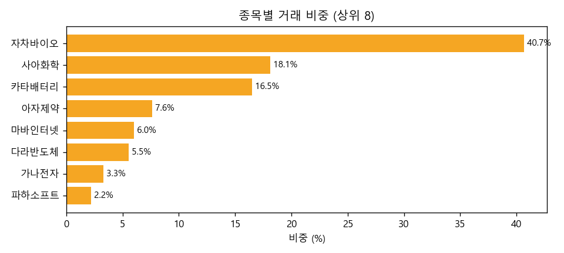
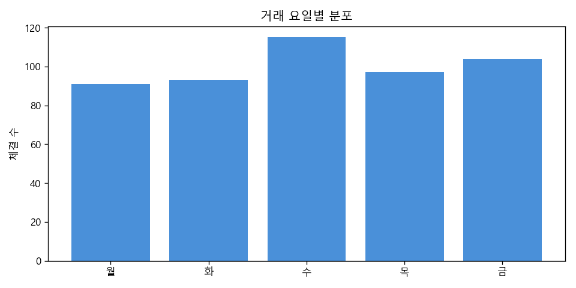
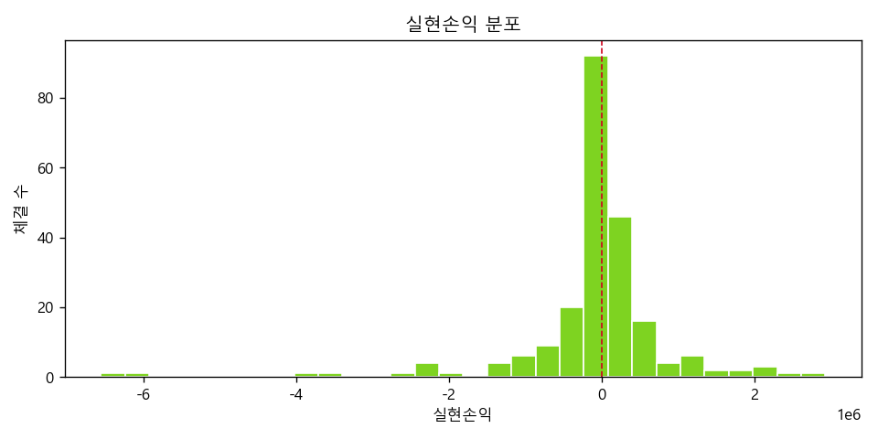

# 🐠 GoldFish

> 내 투자·거래 데이터를 어항 들여다보듯 분석해주는 도구
>
> **Watch your money swim.**

CSV(추후 토스증권 조회 API)로 투자·거래 데이터를 넣으면 **통계 프로파일링 + 금융 특화 진단 + AI 자연어 코칭**을 담은 리포트를 만들어 주는 Python 라이브러리/CLI입니다.

기존 범용 프로파일링 도구와 달리 **금융 데이터에 특화**되어 있고, 분석 결과를 AI가 사람 말로 해설·경고해 주는 것이 차별점입니다.

---

## ✨ 기능

**v0.1 — 기본 프로파일링**

- 📥 **CSV 로더** — 한글/BOM/`cp949` 자동 처리
- 📊 **기본 프로파일링** — 행·열 수, 결측치, 데이터 타입, 분포(평균/중앙/표준편차/분위)
- 🔎 **이상치 탐지** — IQR(1.5배) 기준
- 🔗 **상관관계** — 수치형 컬럼 간 상관계수 상위 페어
- 🖥 **CLI** — `goldfish <csv경로>` 한 줄로 텍스트 리포트

**v0.2 — 금융 특화 진단 + 차트**

- 🧮 **스키마 검증** — 거래내역 필수 컬럼 자동 인식(필요 시 안내), 식별자(종목코드) 분리
- 🥧 **포트폴리오 집중도** — 종목별 비중, 상위 N 편중도, HHI 집중지수
- 🔁 **매매 패턴** — 매수/매도 빈도, 거래일당 체결 수(과매매 지표), 요일·시각대 분포
- 🎯 **손절·익절 습관** — 승률, 손익비(Profit Factor), 평균/최대 익절·손절
- 📈 **수익률·변동성** — 실현손익 기반 수익률·변동성 추정
- 📊 **차트** — 종목 비중 막대, 거래 분포, 실현손익 히스토그램 PNG 저장

**v0.3 — AI 자연어 코칭**

- 🤖 **AI 요약** — 분석 수치를 Gemini(무료 티어)가 사람 말로 해설·경고
- 🛡 **가드레일** — "진단·설명만, 투자 추천 금지" 시스템 프롬프트로 강제
- 🔌 **기본 끔 + fallback** — 키(`GEMINI_API_KEY`)가 없으면 통계만 출력(크래시 없음)

> 로드맵: ~~v0.2 금융 특화 진단·차트~~ ✅ · ~~v0.3 AI 코칭~~ ✅ · v0.4 토스 연동·HTML 리포트 · v1.0 PyPI 배포

---

## 📦 설치

```bash
git clone https://github.com/jinuk-james-lee/goldfish.git
cd goldfish
pip install -e .
```

> Python 3.10+ 필요. (PyPI 배포는 v1.0 예정)

---

## 🚀 사용 예시

```bash
# 샘플 합성 데이터 생성
python examples/generate_sample.py

# 분석 리포트 출력
goldfish examples/sample.csv
```

라이브러리로도 사용할 수 있습니다:

```python
from goldfish.loaders.csv import load_csv
from goldfish.analyzers.basic import analyze_basic
from goldfish.report.text import render_text

df = load_csv("examples/sample.csv")
result = analyze_basic(df)   # dict — 텍스트/HTML/AI 계층에서 재사용
print(render_text(result))
```

출력 예시:

```
====================================================
🐠 GoldFish 기본 분석 리포트
====================================================

[ 개요 ]  500행 × 8열
  ...
[ 이상치 (IQR 1.5배) ]
  - 거래금액: 54개 (10.8%) ...
[ 상관관계 상위 ]
  - 단가 ↔ 거래금액: +0.768
```

### 금융 특화 진단 (v0.2)

거래내역 스키마(`체결일, 종목명, 매매구분, 수량, 단가, 거래금액` 필수 / `종목코드, 실현손익` 선택)가
감지되면 기본 리포트에 이어 금융 진단이 자동으로 출력됩니다.

```
====================================================
🐠 GoldFish 금융 특화 진단
====================================================

[ 포트폴리오 집중도 ]
  거래 종목 수: 8개
  최다 비중 종목: 40.68% / 상위 3종목: 75.30%
  HHI(집중지수, 1=완전집중): 0.2397

[ 매매 패턴 ]
  매수 278회 / 매도 222회 (매수:매도 1.25)
  거래일 214일 / 총 500체결 → 거래일당 2.34체결 (하루 최대 7)

[ 손절·익절 습관 (실현손익) ]
  실현 222건 (익절 116 / 손절 106) → 승률 52.25%
  손익비(Profit Factor): 0.73
```

차트 PNG 저장:

```bash
goldfish examples/sample.csv --charts ./charts   # matplotlib 필요: pip install "goldfish[charts]"
```

| 종목 비중 | 거래 분포 | 실현손익 분포 |
|---|---|---|
|  |  |  |

라이브러리로도 사용할 수 있습니다:

```python
from goldfish.loaders.csv import load_csv
from goldfish.analyzers.finance import analyze_finance, is_finance_df
from goldfish.report.charts import save_all

df = load_csv("examples/sample.csv")
if is_finance_df(df):
    diagnosis = analyze_finance(df)        # dict — 집중도/패턴/손익/수익률
    save_all(df, "charts")                 # PNG 3종 저장
```

### AI 자연어 코칭 (v0.3)

분석 수치를 LLM(Gemini 무료 티어)이 사람 말로 해설해 줍니다. **기본값은 꺼짐**이며,
`GEMINI_API_KEY`가 없으면 이 단계만 조용히 건너뛰고 통계 리포트는 그대로 출력됩니다.

```bash
pip install -e ".[ai]"                 # google-genai 설치
cp .env.example .env                   # .env 에 GEMINI_API_KEY 채우기
goldfish examples/sample.csv --ai      # 통계 + 금융 진단 + AI 요약
```

> 키 발급: <https://aistudio.google.com/apikey> (무료 티어). 키가 없으면 `--ai` 를 줘도
> "AI 요약 건너뜀" 안내만 뜨고 통계는 정상 출력됩니다.

라이브러리로도 사용할 수 있습니다:

```python
from goldfish.loaders.csv import load_csv
from goldfish.report.summary import summary

df = load_csv("examples/sample.csv")
text = summary(df)            # 자연어 요약(str) — 키 없으면 None (통계만)
if text:
    print(text)
```

> 🛡 AI 출력도 **진단·설명용**이며 투자 추천이 아닙니다(프롬프트 가드레일로 강제).

---

## 🧪 개발

```bash
pip install -e ".[dev]"
pytest
```

---

## ⚠️ 면책 / 안전 원칙

- 본 도구는 **데이터 진단·설명용**이며, **투자 추천·자문이 아닙니다.** 투자 판단의 책임은 사용자 본인에게 있습니다.
- 토스증권 연동(v0.4 예정)은 **조회(read-only) 전용**입니다 — 주문/매매 기능은 제공하지 않습니다.
- API 키는 반드시 `.env`에만 보관하세요 (`.env.example` 참고). 저장소에 커밋 금지.
- 저장소의 샘플 데이터는 **100% 합성 데이터**이며 실제 거래 정보가 아닙니다.
- "토스"는 해당 사 상표이며, 본 프로젝트는 **비공식** 연동 도구입니다.

---

## 📄 라이선스

[MIT](LICENSE) © 2026 James Lee
